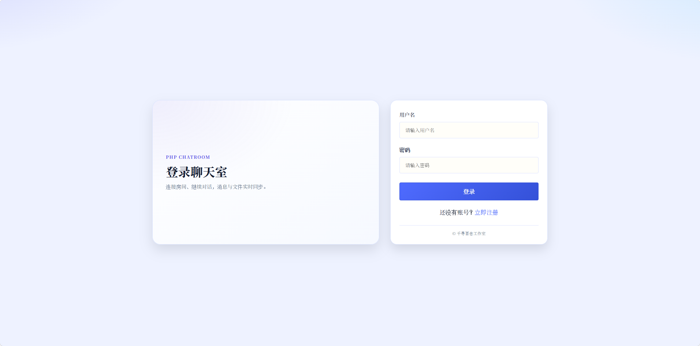
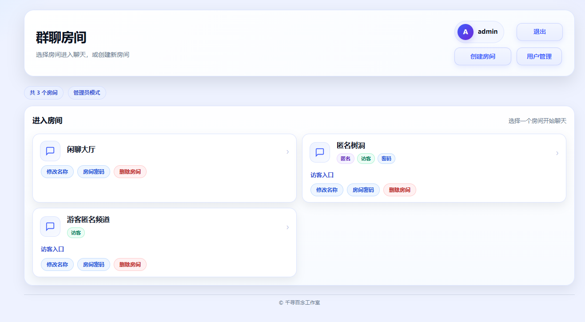
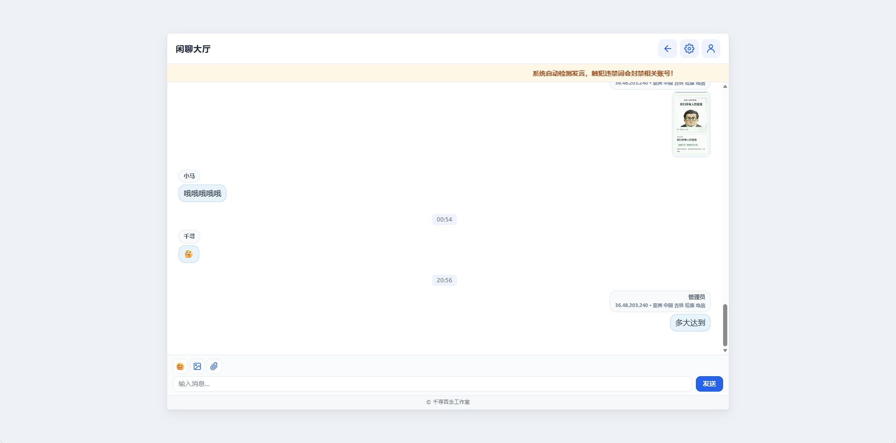
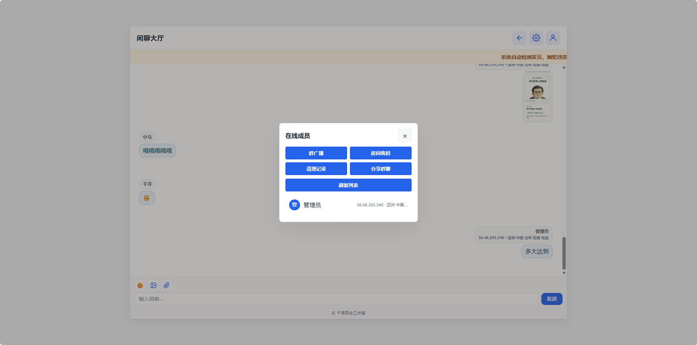
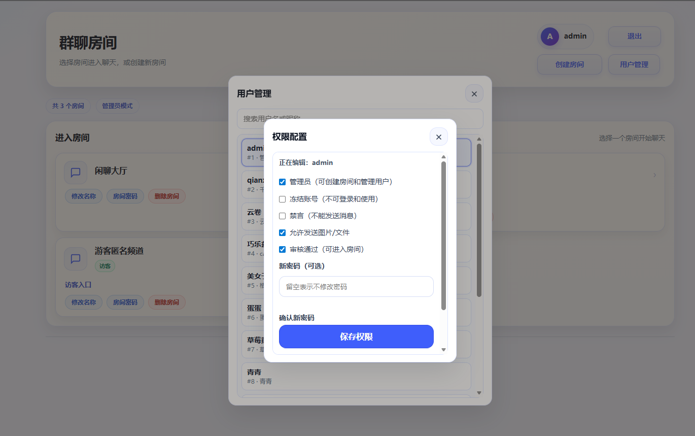
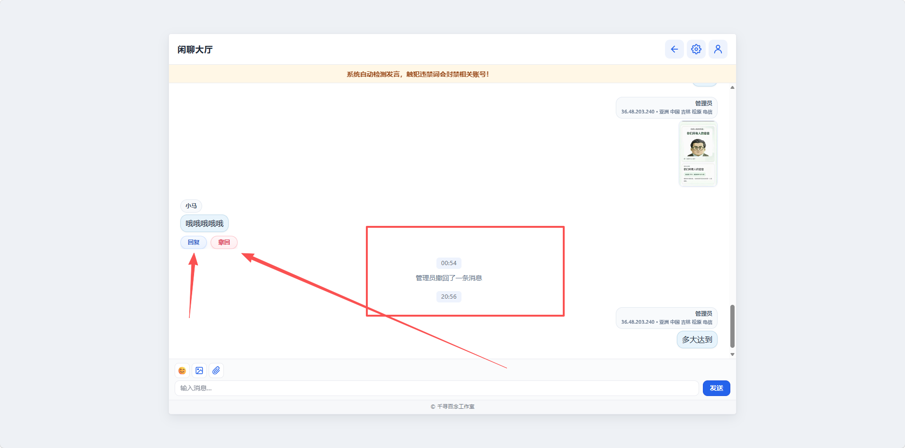

# 千寻聊天室2.0

一个基于PHP和JavaScript开发的轻量级实时多人聊天室系统，具有简洁的界面和流畅的用户体验。

## 功能特点

QXChat 是一个基于 PHP + MySQL + 原生 JavaScript 的轻量级实时多人聊天室系统，提供多房间聊天、匿名/访客模式与完善的管理员管理能力，界面采用毛玻璃风格并适配移动端，支持快速部署与一键安装。

功能
多房间：房间列表、创建/重命名/删除（管理员）

房间权限：可选 匿名模式、可选 允许访客进入、支持 房间密码（门页验证）

实时聊天：消息轮询刷新、最近消息加载、时间分隔条

消息能力：回复引用、撤回（普通用户限时 2 分钟；管理员可撤回非系统消息）

图片/文件发送：支持发送图片与常见文件类型（可按用户权限控制是否允许发文件）

在线成员：在线列表与活跃刷新；管理员可查看在线成员 IP/粗略地理信息（用于管理定位）

群广播：管理员可设置房间顶部滚动广播条

用户体系：注册/登录/退出、修改昵称

管理后台/权限控制：用户管理、冻结账号、禁言、发文件权限、审核通过（可进入房间）

清理能力：管理员可一键清空指定房间聊天记录（含在线信息与附件清理）

分享：生成房间分享链接，并在前端生成二维码（外部二维码服务）

部署/安装

访问 install.php 可 一键初始化数据库表、创建默认房间并生成首个管理员账号（安装完成后建议删除 install.php）

运行环境：PHP（需启用 pdo_mysql）+ MySQL

php需要安装扩展fileinfo

## 界面预览

### 登录界面

### 房间列表界面

### 聊天室界面

### 聊天室权限

### 权限界面

### 撤回回复界面

## 安装说明

1. 确保您的服务器已安装PHP 7.0或更高版本
2. 将项目文件上传到Web服务器目录
3. 确保`data`目录具有写入权限（777）
4. 访问项目URL即可开始使用

## 使用方法

1. 访问聊天室首页
2. 新用户需要先注册账号
3. 使用注册的账号登录系统
4. 登录后即可参与聊天

## 技术栈

- 前端：HTML5、CSS3、JavaScript
- 后端：PHP
- 数据存储：JSON文件
- UI框架：CSS

## 主要特性

- 实时消息推送
- 用户在线状态监测
- 安全的用户认证系统
- 优美的界面设计
- 简单的部署方式

## 开源协议

本项目基于 GNU General Public License v3.0 开源协议。

## Star History

